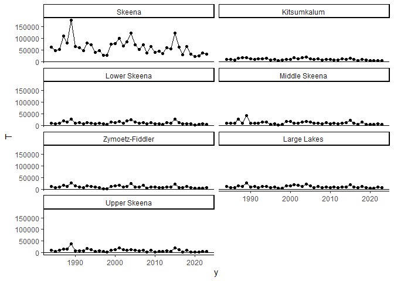

<!-- README.md is generated from README.Rmd. Please edit that file -->

# skrunchy

<!-- badges: start -->
<!-- badges: end -->

**Sk**eena River **Run** Reconstruction for **Ch**inook Salmon

The goal of skrunchy is to recreate and update the run reconstruction
for Skeena River (summer run timing) Chinook upstream of Tyee test
fishery, as documented in [Winther et
al. 2024](https://publications.gc.ca/site/eng/9.901355/publication.html "An assessment of Skeena River Chinook salmon using genetic stock identification 1984 to 2020")

## Installation

You can install the development version of skrunchy from
[GitHub](https://github.com/) with:

    install.packages("pak")
    pak::pak("Pacific-salmon-assess/skrunchy")

``` r
library(skrunchy)
#> Loading required package: abind
#> Loading required package: rrandvec
#> Loading required package: here
#> here() starts at C:/github/skrunchy
library(ggplot2)
```

## Example

Make some fake genetic proportion and catch data, expand to estimates of
annual proportions, and plot:

``` r

d <- make_P_G()
res <- get_P_tilde(P = d$P, sigma_P = d$sigma_P, G = d$G)
dp <- res$df_merged

ggplot(dp, aes(y = P_tilde, x = y, group = i)) +
  geom_errorbar( aes( ymin = P_tilde - sigma_P_tilde, ymax = P_tilde + sigma_P_tilde ), colour="dodgerblue") +
  geom_point() +
  geom_line() +
  facet_wrap(~i, ncol=2) +
  geom_hline(aes(yintercept=0)) +
  theme_classic()
```


Now do expansions to get returns to Terrace for each population plus the
aggregate

``` r
k <- read.csv(here("data/kitsumkalum-escapement.csv"))
head(k)
#>   year kitsumkalum_escapement   sd
#> 1 1984                   9569 1644
#> 2 1985                   9081  409
#> 3 1986                   8080  354
#> 4 1987                  15549  991
#> 5 1988                  15853  804
#> 6 1989                  17823 1046
T <- get_T(P_tilde = res$P_tilde, sigma_P_tilde = res$sigma_P_tilde, K= k$kitsumkalum_escapement,
           y = k$year)
dt <- T$df_merged

ggplot(dt, aes(y = T, x = y, group = i)) +
  #geom_errorbar( aes( ymin = P_tilde - sigma_P_tilde, ymax = P_tilde + sigma_P_tilde ), colour="dodgerblue") +
  geom_point() +
  geom_line() +
  facet_wrap(~i, ncol=2) +
  geom_hline(aes(yintercept=0)) +
  theme_classic()
```



<!-- What is special about using `README.Rmd` instead of just `README.md`? You can include R chunks like so: -->
<!-- ```{r cars} -->
<!-- #summary(cars) -->
<!-- ``` -->
<!-- You'll still need to render `README.Rmd` regularly, to keep `README.md` up-to-date. `devtools::build_readme()` is handy for this. -->
<!-- You can also embed plots, for example: -->
<!-- ```{r pressure, echo = FALSE} -->
<!-- #plot(pressure) -->
<!-- ``` -->
<!-- In that case, don't forget to commit and push the resulting figure files, so they display on GitHub and CRAN. -->
