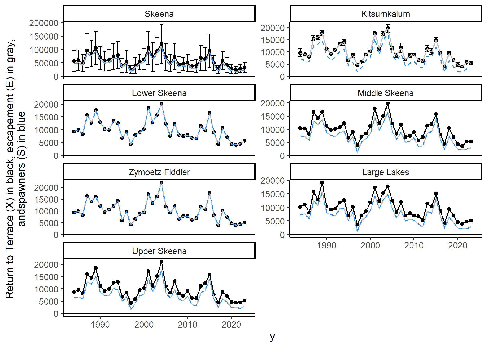
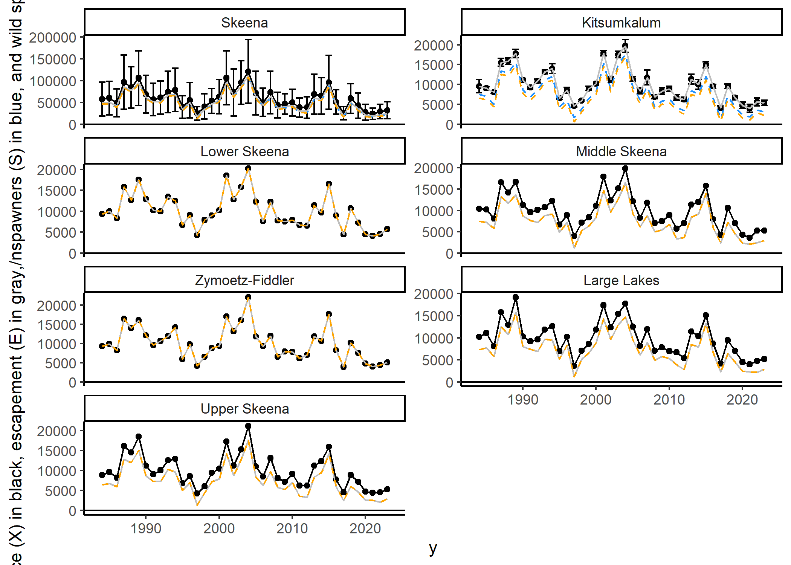

<!-- README.md is generated from README.Rmd. Please edit that file -->

# skrunchy

<!-- badges: start -->
<!-- badges: end -->

**Sk**eena River **Run** Reconstruction for **Ch**inook Salmon

The goal of skrunchy is to recreate and update the run reconstruction
for Skeena River (summer run timing) Chinook upstream of Tyee test
fishery, as documented in [Winther et
al. 2024](https://publications.gc.ca/site/eng/9.901355/publication.html "An assessment of Skeena River Chinook salmon using genetic stock identification 1984 to 2020")

Detailed methods with variables and equations matching (as much as
possible) this package will be added in the file: `methods.PDF`.

## General methods

Here, we take a known abundance of population $K$ and expand it to
estimate an aggregate population size $X_{aggregate}$ using the
proportion of fish from population $K$ in a mixed genetic sample, $P_K$:

$$X_{aggregate} = \frac{K}{P_K}$$

Further, the abundance of other populations $X_i$ can be estimated using
their genetic proportion $P_i$ and the aggregate abundance
$X_{aggregate}$:

$$X_i = X_{aggregate} \cdot P_i$$

After that, the run is “reconstructed”, i.e., from the time the fish are
approximately age 3 ocean fish, all mortalities (fishery, incidental
mortality, brood stock) are added to the estimate of spawners to
estimate total recruits produced by each cohort. This produces estimates
of spawners and recruits by brood year, which can then be use to model
productivity.

## Installation

You can install the development version of skrunchy from
[GitHub](https://github.com/) with:

    install.packages("pak")
    pak::pak("Pacific-salmon-assess/skrunchy")

## Examples (currently use fake data for several data sources - not accurate)

Make some **fake** genetic proportion and catch data (by week), expand
to estimates of annual proportions, and plot:

``` r

d <- make_P_G()
res <- get_P_tilde(P = d$P, sigma_P = d$sigma_P, G = d$G)
dp <- res$df_merged

ggplot(dp, aes(y = P_tilde, x = y, group = i)) +
  geom_errorbar( aes( ymin = P_tilde - sigma_P_tilde, ymax = P_tilde + sigma_P_tilde ), colour="dodgerblue") +
  geom_point() +
  geom_line() +
  facet_wrap(~i, ncol=2) +
  geom_hline(aes(yintercept=0)) +
  theme_classic()
```


Now do expansions to get returns to Terrace for each population plus the
aggregate

``` r
k <- read.csv(here("data/kitsumkalum-escapement.csv"))
X <- get_X(P_tilde = res$P_tilde, sigma_P_tilde = res$sigma_P_tilde, K= k$kitsumkalum_escapement, 
           sigma_K = k$sd,
           y = k$year)
dt <- X$df_merged

ggplot(dt, aes(y = X, x = y, group = i)) +
  geom_errorbar( aes( ymin = X - sigma_X, ymax = X + sigma_X)) +
  geom_point() +
  geom_line() +
  facet_wrap(~i, ncol=2, scales = "free_y") +
  geom_hline(aes(yintercept=0)) +
  theme_classic()
```

 Get
escapement for each population, plot with returns to Terrace (note, will
only be different for Skeena aggregate and the three upper populations)

``` r
tau_F_U <- sample(5000:10000, size=length(k$y), replace=TRUE)
E <- get_E(K = k$kitsumkalum_escapement, X = X$X, tau_F_U = tau_F_U,
     known_population = "Kitsumkalum",
     aggregate_population = "Skeena",
     lower_populations = c("Lower Skeena", "Zymoetz-Fiddler"),
     upper_populations = c("Upper Skeena", "Middle Skeena", "Large Lakes"))
de <- E$df


ggplot(dt, aes(y = X, x = y, group = i)) +
  geom_errorbar( aes( ymin = X - sigma_X, ymax = X + sigma_X)) +
  geom_point() +
  geom_line() +
  geom_line(data = de, aes(y = E, x = y, group=i), colour="gray") +
  facet_wrap(~i, ncol=2, scales = "free_y") +
  ylab("Return to Terrace (X) in black, escapement (E) in gray") +
  geom_hline(aes(yintercept=0)) +
  theme_classic()
```


Get spawners for each population (accounts for brood stock removals),
plot with returns to Terrace and escapement. Spawners should only be
different from escapement for Skeena aggregate and Kitsumkalum, since
brood removals are only for Kitsumkalum.

``` r
# make up brood removal data. Much larger than actual values, so that it is visible on plots. 
B <- sample(2000:3000, size=length(k$y), replace=TRUE)
S <- get_S(E = E$E, B = B, 
     brood_population = "Kitsumkalum",
     aggregate_population = "Skeena")
ds <- S$df


ggplot(dt, aes(y = X, x = y, group = i)) +
  geom_errorbar( aes( ymin = X - sigma_X, ymax = X + sigma_X)) +
  geom_point() +
  geom_line() +
  geom_line(data = de, aes(y = E, x = y, group=i), colour="gray") +
  geom_line(data = ds, aes(y = S, x = y, group=i), colour="dodgerblue", linetype=2) +
  facet_wrap(~i, ncol=2, scales = "free_y") +
  ylab("Return to Terrace (X) in black, escapement (E) in gray,\nandspawners (S) in blue") +
  geom_hline(aes(yintercept=0)) +
  theme_classic()
```



Get wild spawners for each population (accounts for hatchery origin
spawners), plot with returns to Terrace, escapement, and spawners. Wild
spawners should only be different from spawners for Skeena aggregate and
Kitsumkalum, since hatchery origin spawners only occur for Kitsumkalum.

``` r
# make up hatchery spawners data. Larger than actual values, so that it is visible on plots. 
H <- sample(600:1000, size=length(k$y), replace=TRUE)
# get Wild spawners
W <- get_W( S = S$S, H = H) 
dw <- W$df


ggplot(dt, aes(y = X, x = y, group = i)) +
  geom_errorbar( aes( ymin = X - sigma_X, ymax = X + sigma_X)) +
  geom_point() +
  geom_line() +
  geom_line(data = de, aes(y = E, x = y, group=i), colour="gray") +
  geom_line(data = ds, aes(y = S, x = y, group=i), colour="dodgerblue", linetype=2) +
  geom_line(data = dw, aes(y = W, x = y, group=i), colour="orange", linetype=2) +
  facet_wrap(~i, ncol=2, scales = "free_y") +
  ylab("Return to Terrace (X) in black, escapement (E) in gray,\nspawners (S) in blue, and wild spawners in orange") +
  geom_hline(aes(yintercept=0)) +
  theme_classic()
```



Get proportion wild spawners for each population and plot. Should only
be \<1 for Skeena aggregate and Kitsumkalum, since hatchery origin
spawners only occur for Kitsumkalum. Note this is not real data, p is
very high for Kitsumkalum across years.

``` r
p <- get_p(W = W$W, E = E$E)
dp <- p$df


ggplot(dp, aes(y = p, x = y, group = i)) +
  geom_point() +
  geom_line() +
  facet_wrap(~i, ncol=2) +
  ylab("Proportion wild spawners") +
  geom_hline(aes(yintercept=0)) +
  theme_classic()
```


Get age proportions by age, population and year (fake data).

``` r
 populations <- c("Kitsumkalum", "Lower Skeena", "Zymoetz-Fiddler", "Upper Skeena", "Middle Skeena", "Large Lakes", "Skeena")
  n_populations <- length(populations)
  years <- k$year
  n_years <- length(years)
  ages <- c(3,4,5,6,7)
  p_ages <- c(20,30,40,40,1)
  n_ages <- length(ages)
  # Make up some age data
  d <- sapply(p_ages, FUN = function(x){ rpois( n = n_populations*n_years, lambda= x) })
  n <- array( d,  dim = c(n_populations, n_years, n_ages), dimnames = list(i = populations, y = years, a = ages))
  omega <- get_omega(n)
do <- omega$df

ggplot( do, aes(y = omega, x = y, group = i)) +
  geom_point() + 
  geom_line() + 
  facet_grid( i ~ a) + 
  theme_bw()
```


<!-- What is special about using `README.Rmd` instead of just `README.md`? You can include R chunks like so: -->
<!-- ```{r cars} -->
<!-- #summary(cars) -->
<!-- ``` -->
<!-- You'll still need to render `README.Rmd` regularly, to keep `README.md` up-to-date. `devtools::build_readme()` is handy for this. -->
<!-- You can also embed plots, for example: -->
<!-- ```{r pressure, echo = FALSE} -->
<!-- #plot(pressure) -->
<!-- ``` -->
<!-- In that case, don't forget to commit and push the resulting figure files, so they display on GitHub and CRAN. -->
