<!-- README.md is generated from README.Rmd. Please edit that file -->

# skrunchy

<!-- badges: start -->
<!-- badges: end -->

**Sk**eena River **Run** Reconstruction for **Ch**inook Salmon

The goal of skrunchy is to recreate and update the run reconstruction
for Skeena River summer run timing Chinook upstream of Tyee test fishery
(aggregate plus six Conservation Units), as documented in [Winther et
al. 2024](https://publications.gc.ca/site/eng/9.901355/publication.html "An assessment of Skeena River Chinook salmon using genetic stock identification 1984 to 2020").

Detailed methods with variables and equations matching (as much as
possible) this package will be added in the file: `methods.PDF`.

## General methods

Here, we take a known abundance of population (in this case,
Kitsumkalum) $K$ and expand it to estimate an aggregate population size
$X_{aggregate}$ using the proportion of fish from population $K$ in a
mixed genetic sample, $P_K$:

$$X_{aggregate} = \frac{K}{P_K}$$

Further, the abundance of other populations $X_i$ can be estimated using
their genetic proportion $P_i$ and the aggregate abundance
$X_{aggregate}$:

$$X_i = X_{aggregate} \cdot P_i$$

After that, the run is “reconstructed”: working backwards from
age-specific wild spawner abundance, all mortalities (brood stock
removals, fishery harvest, incidental mortality) are added back in, to
estimate total recruits produced by brood year. This produces estimates
of spawners and recruits by brood year, which can then be use to model
productivity.

## Installation

You can install the development version of skrunchy from
[GitHub](https://github.com/) with:

    install.packages("pak")
    pak::pak("Pacific-salmon-assess/skrunchy")

## Example data

The `data/` folder contains example data that are all made up (exception
is Kitsumkalum River escapement data), so don’t use this for any
analysis. This is only for package testing and examples. Example data
goes from return years 1984-2020.

Example data sets start with the prefix `ex_`.

## Examples (currently use fake data for several data sources - testing only)

We can walk through all the functions with example data.

Note that most of the package functions produce lists with two elements.
The first element is an array, and the second element is a data frame.
The array is used for subsequent analysis, and the data frame is useful
for plotting and producing report tables.

Use example data from Skeena Tyee test fishery weekly catch and genetic
mixture data, and pool it into annual genetic proportions.

``` r
library(skrunchy)
#> Loading required package: abind
#> Loading required package: here
#> here() starts at C:/github/skrunchy
library(ggplot2)
library(latex2exp)
options(scipen = 999)


P_tilde <- get_P_tilde(P = ex_P, sigma_P = ex_sigma_P, G = ex_G)

ggplot( P_tilde$df, aes(y = P_tilde, x = y, group = i)) +
  geom_errorbar( aes( ymin = P_tilde - sigma_P_tilde, ymax = P_tilde + sigma_P_tilde ), colour="dodgerblue") +
  geom_point() +
  geom_line() +
  facet_wrap(~i, ncol=2) +
  ylab(TeX("$\\tilde{P}$")) +
  geom_hline(aes(yintercept=0)) +
  theme_classic() 
```

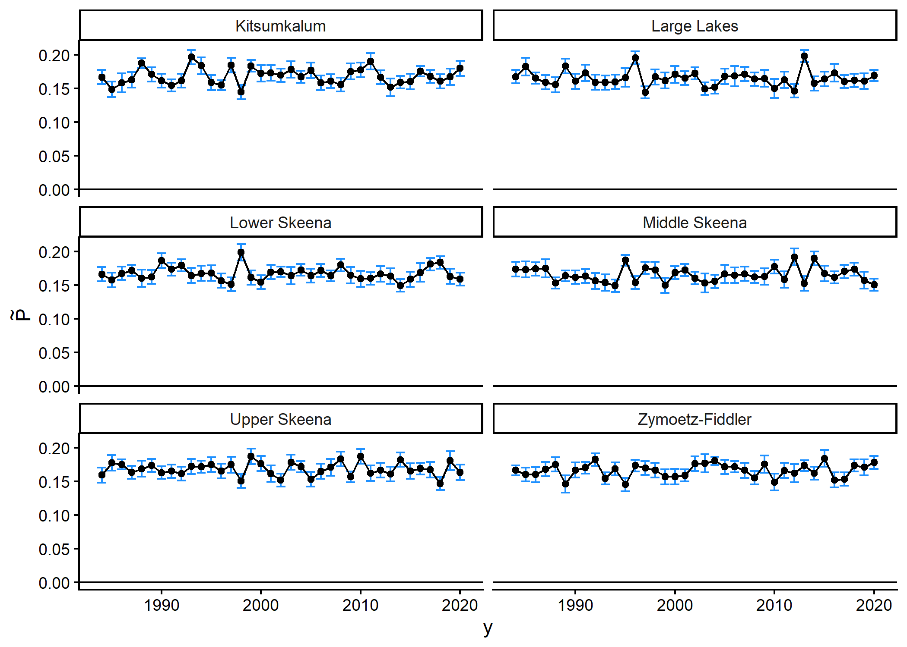

Now do expansions to get returns to Terrace for each population, and the
Skeena aggregate.

``` r
X <- get_X(P_tilde = P_tilde$P_tilde, sigma_P_tilde = P_tilde$sigma_P_tilde, K= ex_k$kitsumkalum_escapement, 
           sigma_K = ex_k$sd,
           y_K = ex_k$year)

ggplot( X$df, aes(y = X, x = y, group = i)) +
  geom_errorbar( aes( ymin = X - sigma_X, ymax = X + sigma_X)) +
  geom_point() +
  geom_line() +
  facet_wrap(~i, ncol=2, scales = "free_y") +
  geom_hline(aes(yintercept=0)) +
  theme_classic()
```

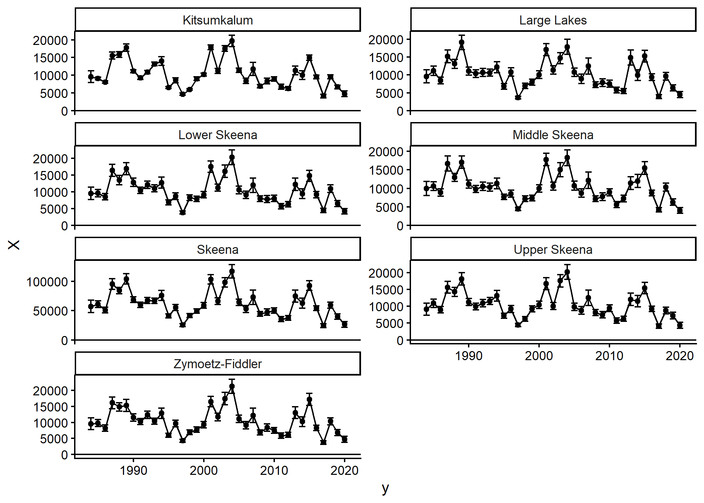

Get escapement for each population, plot with returns to Terrace (note,
will only be different for Skeena aggregate and the three upper
populations). See below for $T_U$ calculations.

``` r
E <- get_E(K = ex_k$kitsumkalum_escapement, X = X$X, Tau_U = ex_Tau_U_total,
     known_population = "Kitsumkalum",
     aggregate_population = "Skeena",
     lower_populations = c("Lower Skeena", "Zymoetz-Fiddler"),
     upper_populations = c("Upper Skeena", "Middle Skeena", "Large Lakes"))

ggplot(X$df, aes(y = X, x = y, group = i)) +
  geom_errorbar( aes( ymin = X - sigma_X, ymax = X + sigma_X)) +
  geom_point() +
  geom_line() +
  geom_line(data = E$df, aes(y = E, x = y, group=i), colour="gray") +
  facet_wrap(~i, ncol=2, scales = "free_y") +
  ylab("Return to Terrace (X) in black, escapement (E) in gray") +
  geom_hline(aes(yintercept=0)) +
  theme_classic()
```

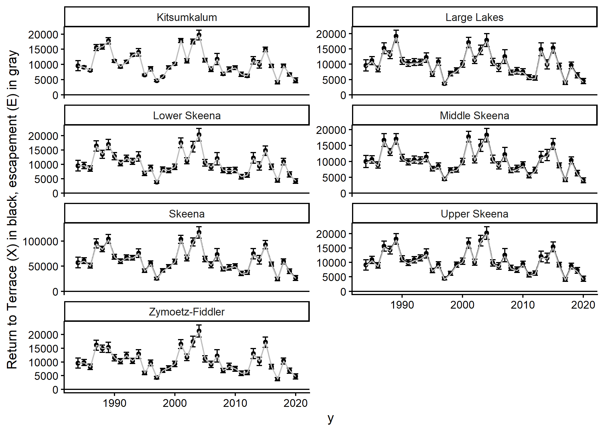

Get age proportions by age, population and year (fake data).

``` r
omega <- get_omega(ex_n)

ggplot( omega$df, aes(y = omega, x = y, group = i)) +
  geom_point() + 
  geom_line() + 
  geom_hline(aes(yintercept=0)) + 
  ylab(TeX("$\\Omega$") )+
  facet_grid( i ~ a ) + 
  theme_classic() +
  theme(axis.text.x = element_text(angle=90, vjust=0.5),
        strip.text.y = element_text(angle = 0))
```

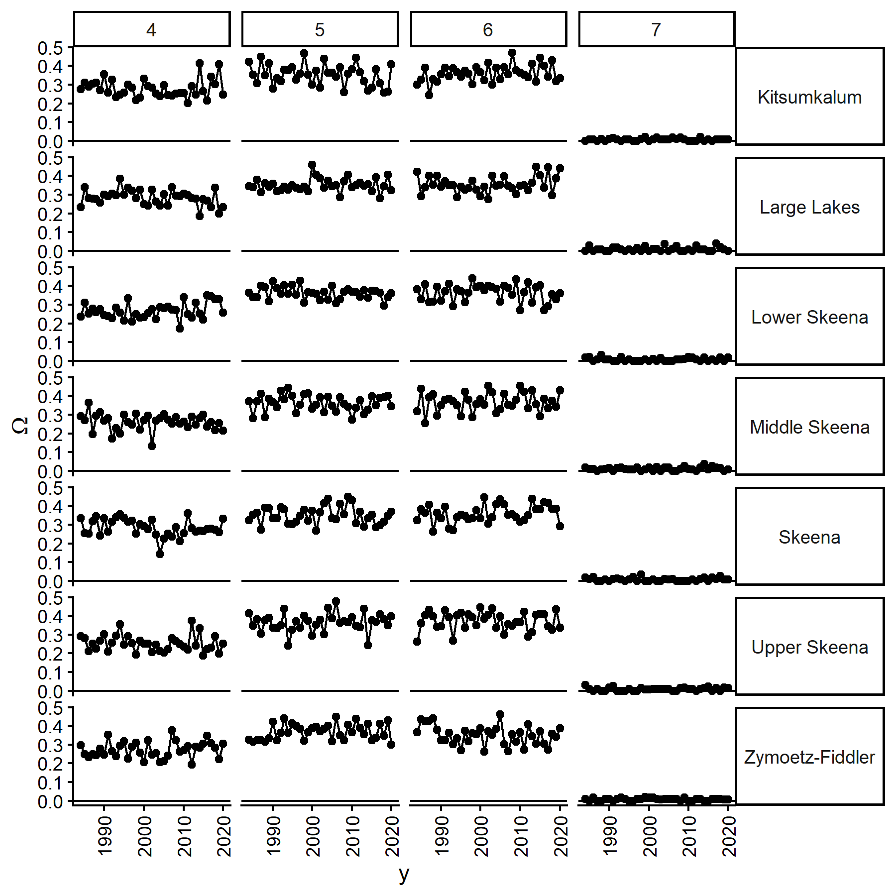

Get age-specific escapement by using age proportions.

``` r
E_star <- get_E_star(E = E$E, omega = omega$omega, K_star = ex_K_star, add_6_7 = TRUE)

ggplot( E_star$df, aes(y = E_star, x = y, group = i)) +
  geom_point( colour="gray") + 
  geom_line( colour="gray") + 
  geom_hline(aes(yintercept=0)) + 
  facet_grid( i ~ a , scales = "free_y") + 
  ylab("Escapement (E*)") +
  theme_classic() +
  theme(axis.text.x = element_text(angle=90, vjust=0.5),
        strip.text.y = element_text(angle = 0))
```

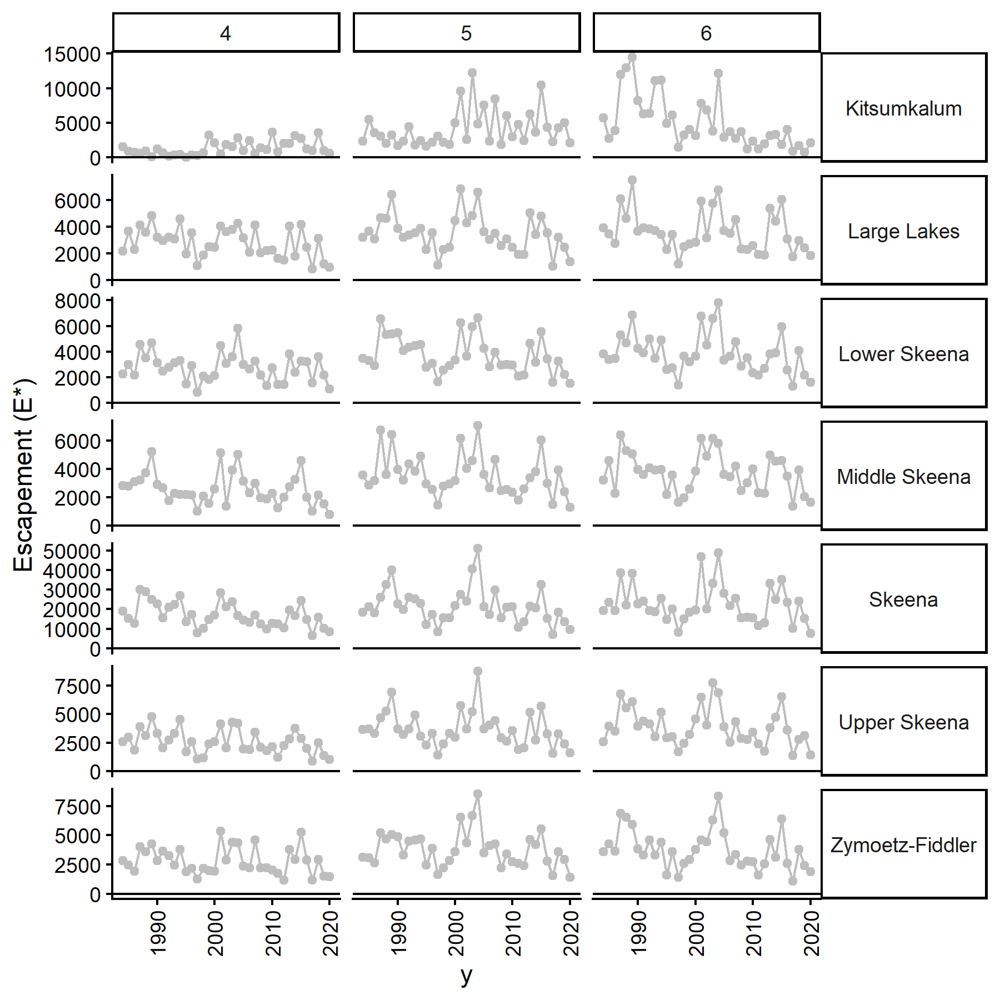

Get spawners for each population (accounts for brood stock removals),
plot with returns to Terrace and escapement. Spawners should only be
different from escapement for Skeena aggregate and Kitsumkalum, since
brood removals are only for Kitsumkalum.

``` r
S_star <- get_S_star(E_star = E_star$E_star, B_star = ex_B_star)

ggplot( E_star$df, aes(y = E_star, x = y, group = i)) +
  geom_point(colour="gray") + 
  geom_line(colour="gray") + 
  geom_line(data = S_star$df, aes(y = S_star, x = y, group = i), colour="dodgerblue") +
  geom_hline(aes(yintercept=0)) + 
  facet_grid( i ~ a , scales = "free_y") + 
  ylab("Escapement (E*) in gray and spawners (S*) in blue") +
  theme_classic() +
  theme(axis.text.x = element_text(angle=90, vjust=0.5),
        strip.text.y = element_text(angle = 0))
```

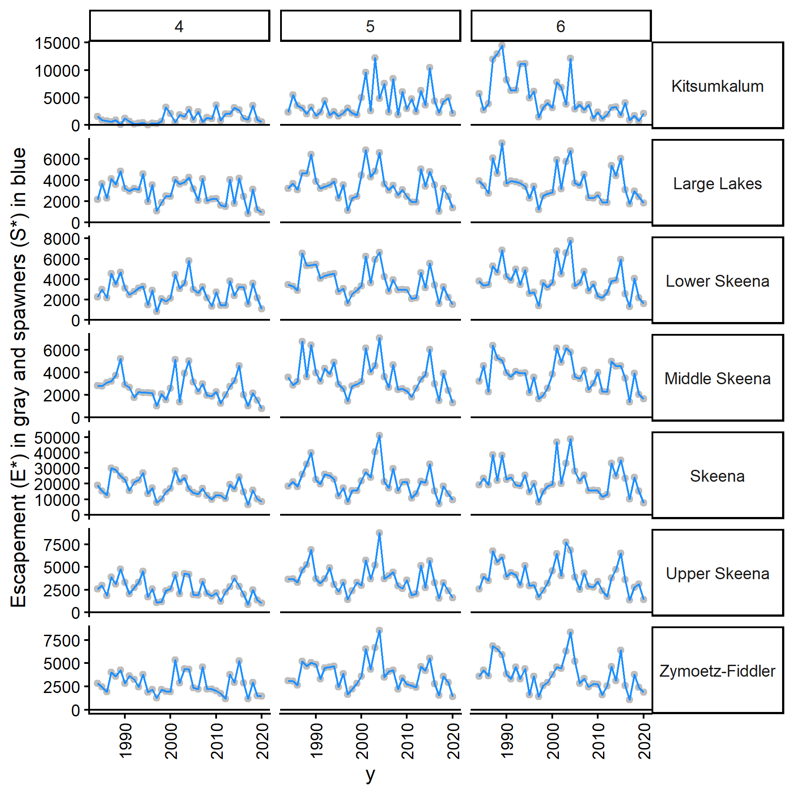

Get wild spawners for each population (accounts for hatchery origin
spawners), plot with returns to Terrace, escapement, and spawners. Wild
spawners should only be different from spawners for Skeena aggregate and
Kitsumkalum, since hatchery origin spawners only occur for Kitsumkalum.

``` r
W_star <- get_W_star( S_star = S_star$S_star, H_star = ex_H_star) 

ggplot( E_star$df, aes(y = E_star, x = y, group = i)) +
  geom_point(colour="gray") + 
  geom_line(colour="gray") + 
  geom_line(data = W_star$df, aes(y = W_star, x = y, group = i), colour="firebrick") +
  geom_line(data = S_star$df, aes(y = S_star, x = y, group = i), colour="dodgerblue") +
  geom_hline(aes(yintercept=0)) + 
  facet_grid( i ~ a , scales = "free_y") + 
  ylab("Escapement (E*) in gray, spawners (S*) in blue,\nand wild spawners (W*) in red.") +
  theme_classic() +
  theme(axis.text.x = element_text(angle=90, vjust=0.5),
        strip.text.y = element_text(angle = 0))
```

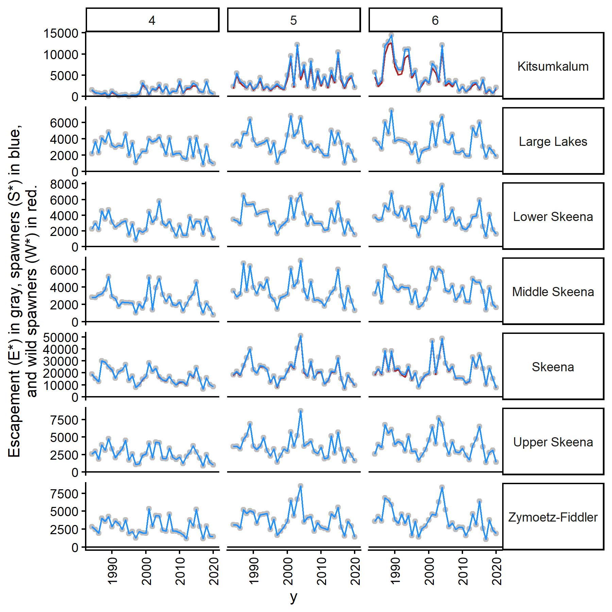

Get proportion wild spawners for each population and plot. Should only
be \<1 for Skeena aggregate and Kitsumkalum, since hatchery origin
spawners only occur for Kitsumkalum. Note this is not real data, p is
very high for Kitsumkalum across years.

``` r
p <- get_p(W_star = W_star$W_star, E_star = E_star$E_star, B_star = ex_B_star)

ggplot(p$df, aes(y = p, x = y, group = i)) +
  geom_point() +
  geom_line() +
  facet_grid(i~a) +
  ylab("Proportion wild spawners, p") +
  geom_hline(aes(yintercept=0)) +
  theme_classic()+
  theme(axis.text.x = element_text(angle=90, vjust=0.5),
        strip.text.y = element_text(angle = 0))
```

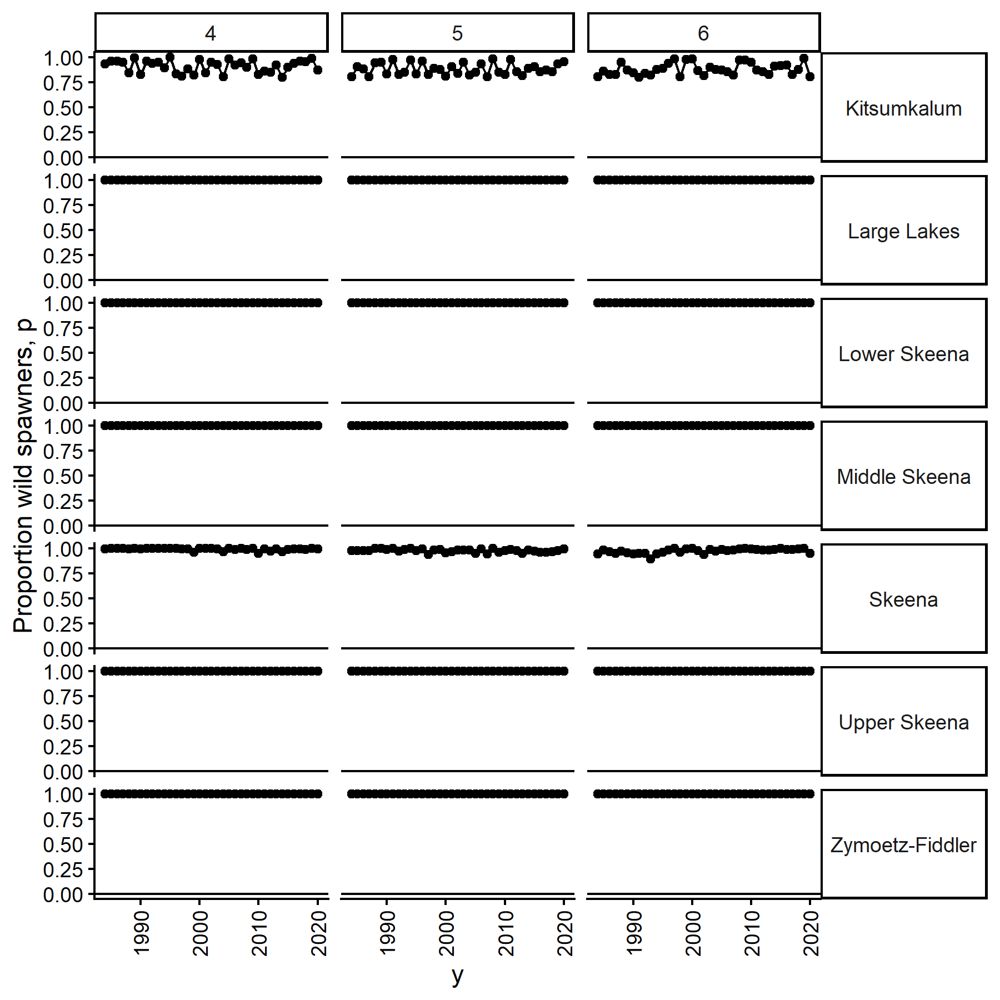

Estimate terminal mortalities

Get age proportions by age, population and year (fake data), including
jacks.

``` r
omega_J_all <- get_omega(ex_n_with_jacks)
omega_J <- omega_J_all$omega["Skeena",,] # only include Skeena

ggplot( omega_J_all$df[ omega_J_all$df$i == "Skeena", ], aes(y = omega, x = y, group = i)) +
  geom_point() + 
  geom_line() + 
  geom_hline(aes(yintercept=0)) + 
  ylab(TeX("$\\Omega_J$") )+
  facet_grid( i ~ a ) + 
  theme_classic() +
  theme(axis.text.x = element_text(angle=90, vjust=0.5),
        strip.text.y = element_text(angle = 0))
```

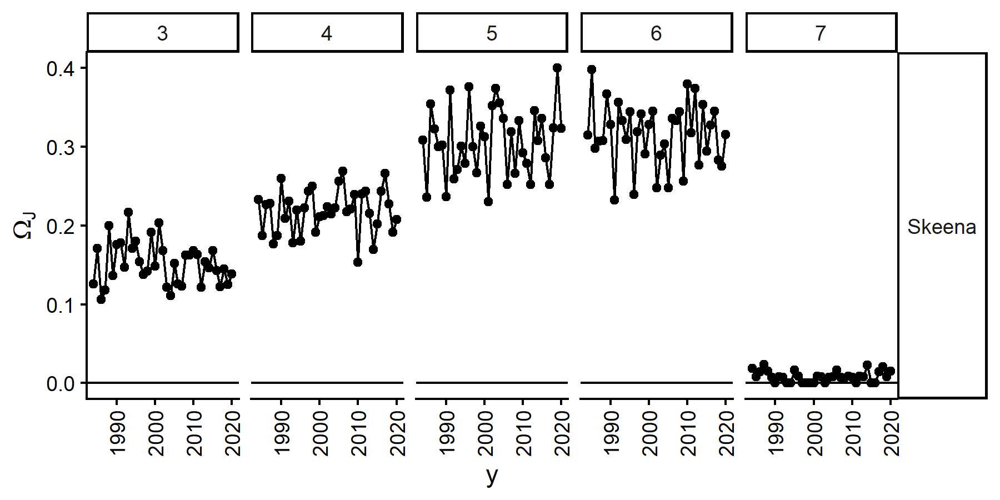

Get freshwater terminal mortalities in the lower Skeena by year

``` r
Tau_L_total <- get_Tau_L_total( omega_J = omega_J, tyee = ex_Tau$tyee, 
                                rec_catch_L = ex_Tau$rec_catch_L,
                                rec_release_L = ex_Tau$rec_release_L, 
                                FN_catch_L = ex_Tau$FN_catch_L)
Tau_L_total_df <- data.frame(Tau_L_total = Tau_L_total, y = names(Tau_L_total))

ggplot( Tau_L_total_df, aes(y = Tau_L_total, x = y, group = 1)) +
  geom_line() + 
  geom_point() + 
  geom_hline(aes(yintercept=0)) + 
  ylab(TeX("$T_L$") )+
  theme_classic() +
  theme(axis.text.x = element_text(angle=90, vjust=0.5),
        strip.text.y = element_text(angle = 0))
```

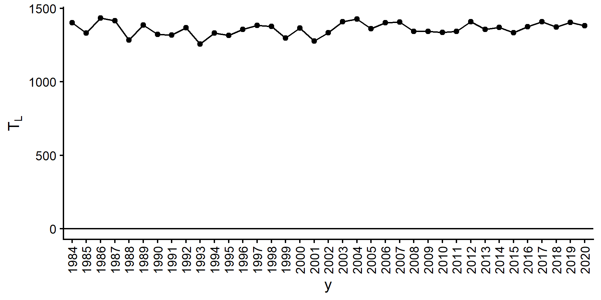

Get freshwater terminal mortalities in the upper Skeena by year

``` r
Tau_U_total <- get_Tau_U_total( omega_J = omega_J, rec_catch_U = ex_Tau$rec_catch_U,
                                   FN_catch_U = ex_Tau$FN_catch_U)
Tau_U_total_df <- data.frame(Tau_U_total, y = names(Tau_U_total))
ggplot( Tau_U_total_df, aes(y = Tau_U_total, x = y, group = 1)) +
  geom_point() + 
  geom_line() + 
  geom_hline(aes(yintercept=0)) + 
  ylab(TeX("$T_U$") )+
  theme_classic() +
  theme(axis.text.x = element_text(angle=90, vjust=0.5),
        strip.text.y = element_text(angle = 0))
```

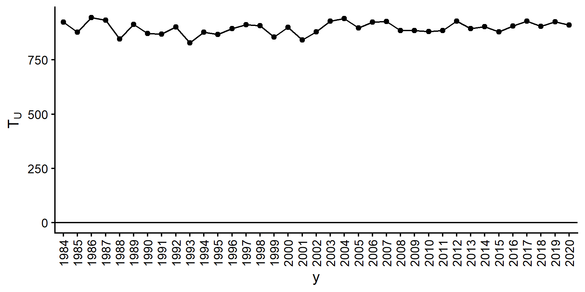

Estimate freshwater terminal mortalities in the lower Skeena by
population, year, and age.

``` r
tau_L <- get_tau_L(Tau_L = Tau_L_total, omega = omega$omega, P_tilde = P_tilde$P_tilde, aggregate_population = "Skeena", add_6_7 = TRUE)

ggplot( tau_L$df , aes(y =tau_L, x = y, group = i)) +
  geom_point() + 
  geom_line() + 
  geom_hline(aes(yintercept=0)) + 
  ylab(TeX("$\\tau_L$")) +
  facet_grid( i ~ a, scales="free_y") + 
  theme_classic() +
  theme(axis.text.x = element_text(angle=90, vjust=0.5),
        strip.text.y = element_text(angle = 0))
```

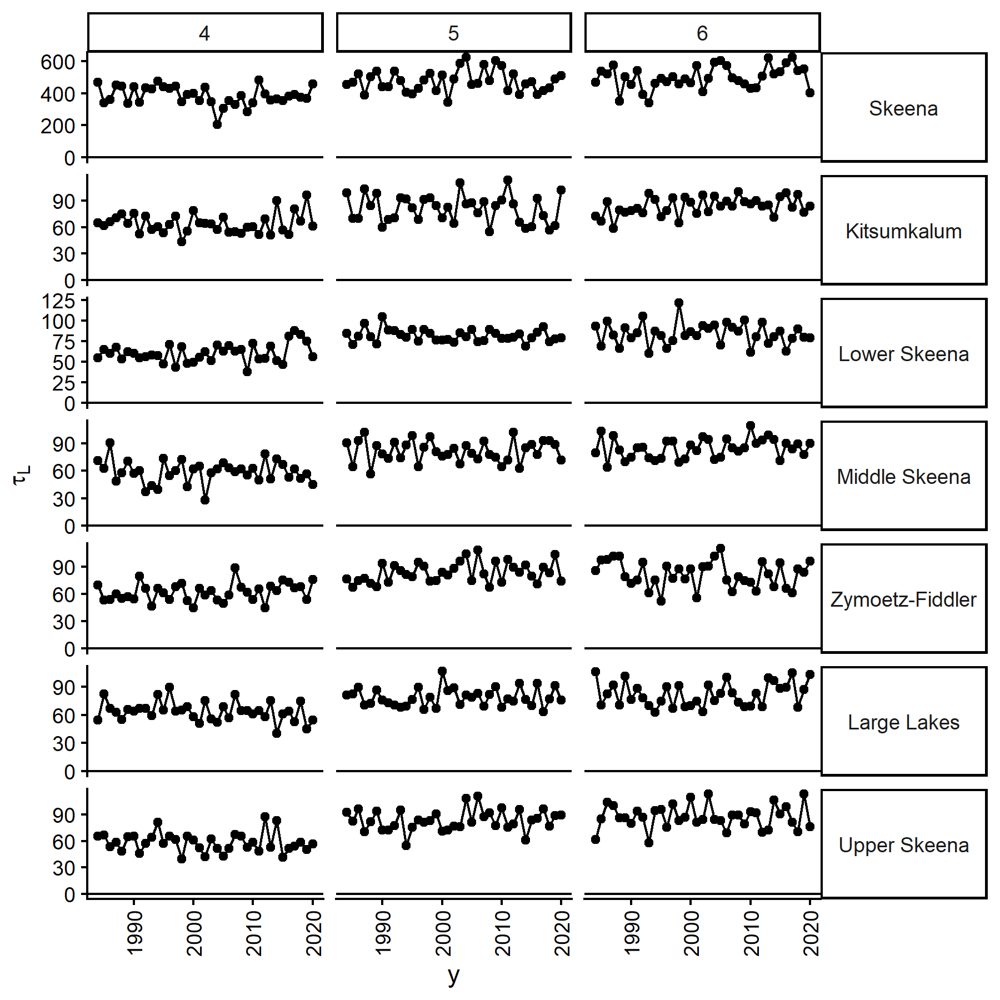

Estimate freshwater terminal mortalities in the upper Skeena by
population, year, and age. Should be 0 for Kitsumkalum, Lower Skeena,
and Zymoetz-Fiddler.

``` r
tau_U <- get_tau_U(Tau_U = Tau_U_total, omega = omega$omega, P_tilde = P_tilde$P_tilde, aggregate_population = "Skeena",
                   upper_populations = c("Middle Skeena", "Large Lakes", "Upper Skeena"),
    lower_populations = c("Lower Skeena", "Kitsumkalum", "Zymoetz-Fiddler"), add_6_7 = TRUE)

ggplot( tau_U$df, aes(y =tau_U, x = y, group = i)) +
  geom_point() + 
  geom_line() + 
  geom_hline(aes(yintercept=0)) + 
  ylab(TeX("$\\tau_U$")) +
  facet_grid( i ~ a) + 
  theme_classic() +
  theme(axis.text.x = element_text(angle=90, vjust=0.5),
        strip.text.y = element_text(angle = 0))
```

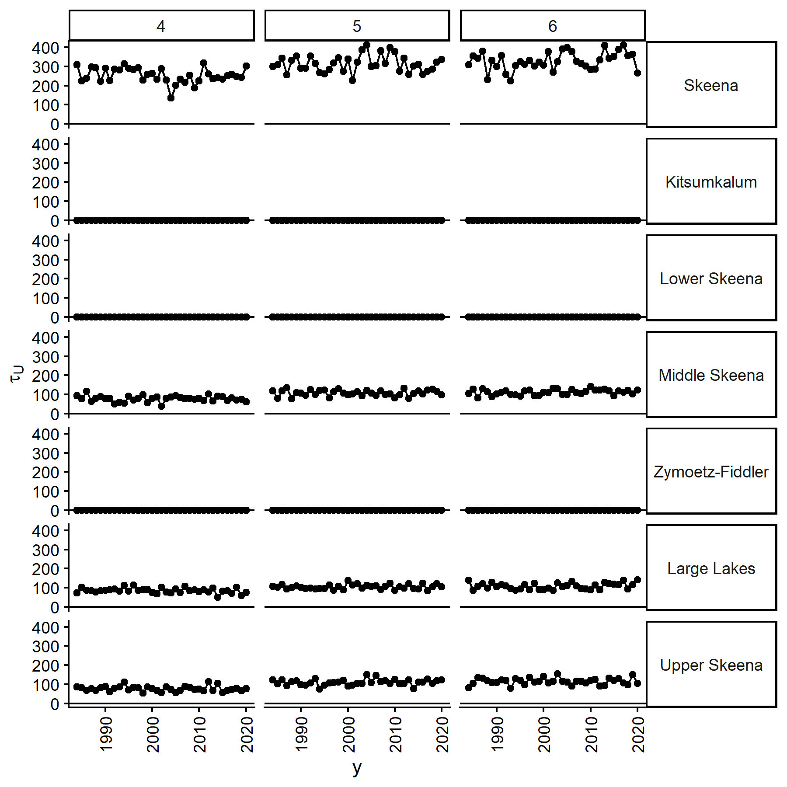

Estimate marine terminal mortalities in the marine area by population,
year, and age.

``` r
tau_M <- get_tau_M( W_star = W_star$W_star, tau_dot_M = ex_tau_dot_M)

ggplot( tau_M$df, aes(y =tau_M, x = y, group = i)) +
  geom_point() + 
  geom_line() + 
  geom_hline(aes(yintercept=0)) + 
  ylab(TeX("$\\tau_M$")) +
  facet_grid( i ~ a, scales="free_y") + 
  theme_classic() +
  theme(axis.text.x = element_text(angle=90, vjust=0.5),
        strip.text.y = element_text(angle = 0))
```

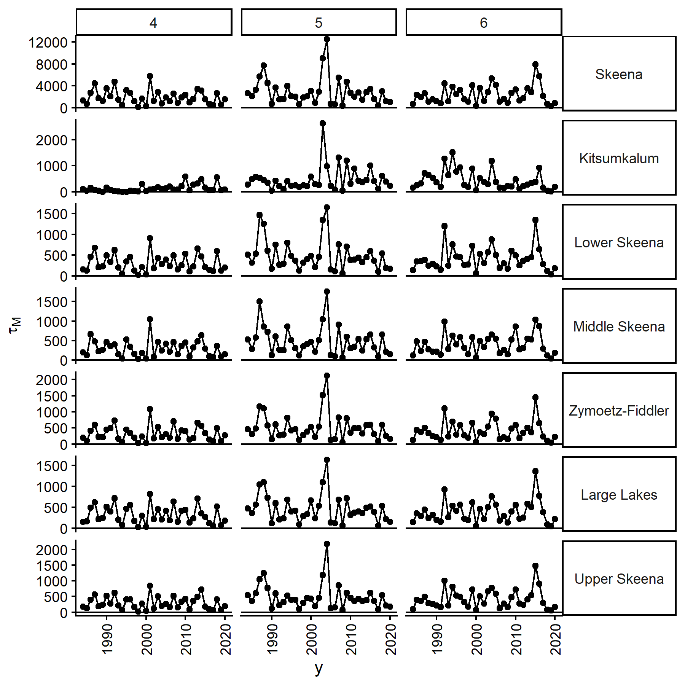

<!-- Get total terminal mortality  -->
<!-- ```{r example_tau, dpi=300, fig.width = w,fig.height=h} -->
<!-- tau <- get_tau(tau_U = tau_U$tau_U, tau_L = tau_L$tau_L, tau_M= tau_M$tau_M) -->
<!-- ggplot( tau$df, aes(y =tau, x = y, group = i)) + -->
<!--   geom_line() + -->
<!--   geom_point() + -->
<!--   geom_line( data = tau_L$df, aes(y =tau_L, x = y), colour="goldenrod") + -->
<!--   geom_line( data = tau_U$df, aes(y =tau_U, x = y), colour="aquamarine") + -->
<!--   geom_line( data = tau_M$df, aes(y =tau_M, x = y), colour="blue") + -->
<!--   geom_hline(aes(yintercept=0)) +  -->
<!--   ylab(TeX("$\\tau$")) + -->
<!--   facet_grid( i ~ a, scales="free_y") +  -->
<!--   theme_classic() + -->
<!--   theme(axis.text.x = element_text(angle=90, vjust=0.5), -->
<!--         strip.text.y = element_text(angle = 0)) -->
<!-- ``` -->

Get wild total terminal mortality

``` r
tau_W <- get_tau_W(tau_U= tau_U$tau_U, tau_L = tau_L$tau_L, tau_M = tau_M$tau_M, p = p$p)

ggplot( tau_W$df, aes(y =tau_W, x = y, group = i)) +
  geom_line() +
  geom_point() +
  geom_hline(aes(yintercept=0)) + 
  geom_line( data = tau_L$df, aes(y =tau_L, x = y), colour="goldenrod") + 
  geom_line( data = tau_U$df, aes(y =tau_U, x = y), colour="aquamarine") + 
  geom_line( data = tau_M$df, aes(y =tau_M, x = y), colour="blue") + 
  ylab(TeX("$\\tau_W$ in black")) +
  facet_grid( i ~ a, scales="free_y") + 
  theme_classic() +
  theme(axis.text.x = element_text(angle=90, vjust=0.5),
        strip.text.y = element_text(angle = 0))
```

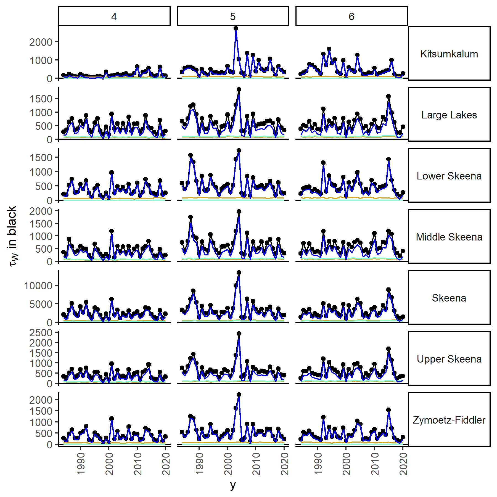

Get wild terminal run

``` r
TermRun <- get_TermRun(tau_W = tau_W$tau_W, W_star = W_star$W_star, B_star = ex_B_star)

ggplot( TermRun$df, aes(y =TermRun, x = y, group = i)) +
  geom_line() +
  geom_point() +
  geom_line( data = tau_W$df, aes(y =tau_W, x = y), colour="darkorange3") +
  geom_line( data = W_star$df, aes(y =W_star, x = y), colour="firebrick") +
  geom_hline(aes(yintercept=0)) + 
  ylab(TeX("$TermRun$ in black, $\\tau_W$ in orange, and $W^*$ in red")) +
  facet_grid( i ~ a, scales="free_y") + 
  theme_classic() +
  theme(axis.text.x = element_text(angle=90, vjust=0.5),
        strip.text.y = element_text(angle = 0))
```

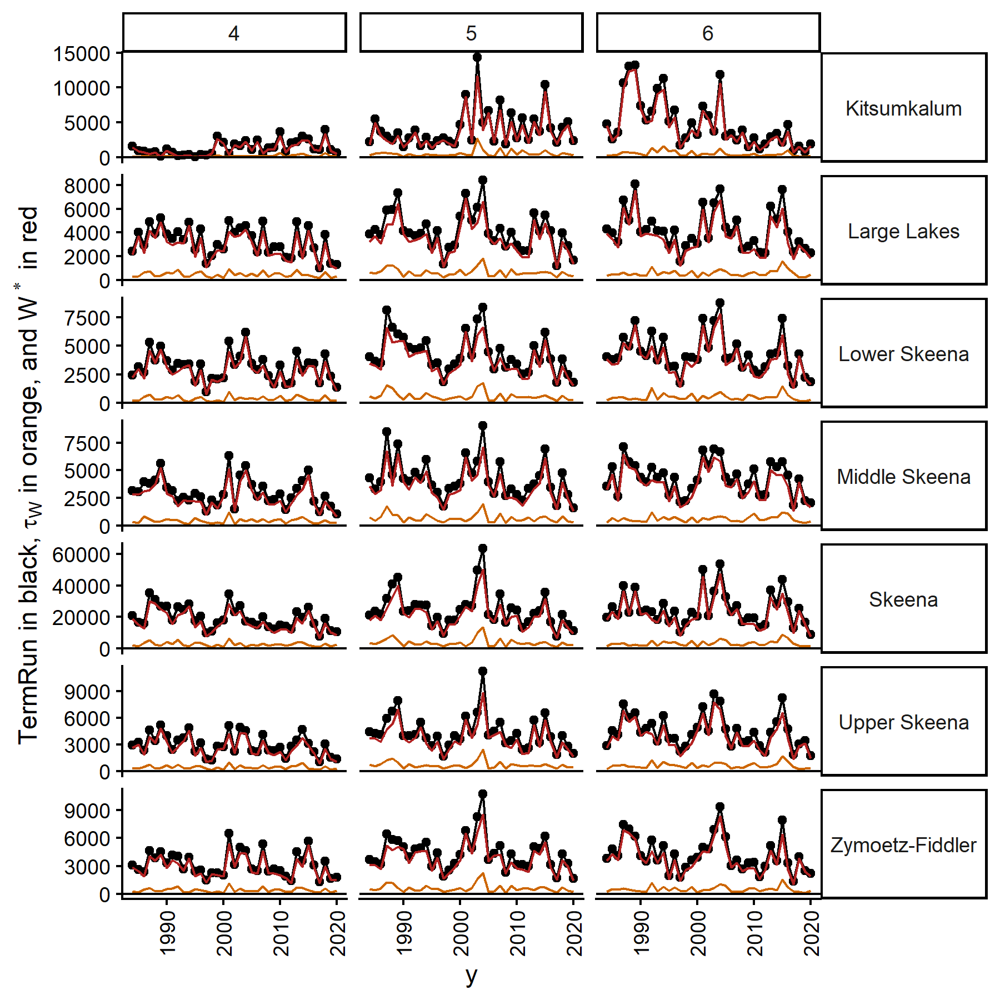

Get mature run

``` r
MatureRun <- get_MatureRun(TermRun = TermRun$TermRun, phi_dot_M = ex_phi_dot_M)

ggplot( MatureRun$df, aes(y =MatureRun, x = y, group = i)) +
  geom_line(colour="darkgreen") +
  geom_point(colour ="darkgreen") +
  geom_line( data = TermRun$df, aes(y =TermRun, x = y, group = i), colour="black") +
  geom_hline(aes(yintercept=0)) + 
  ylab(TeX("$MatureRun$ in green, $TermRun$ in black")) +
  facet_grid( i ~ a, scales="free_y") + 
  theme_classic() +
  theme(axis.text.x = element_text(angle=90, vjust=0.5),
        strip.text.y = element_text(angle = 0))
```

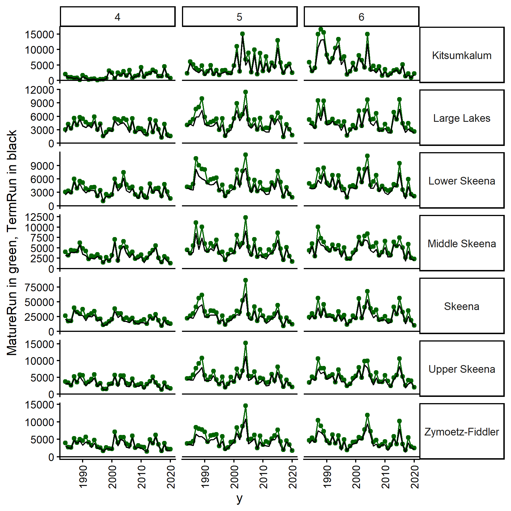

Pre-terminal post fishery abundance.

``` r
A_phi <- get_A_phi( MatureRun = MatureRun$MatureRun, r = ex_r)

ggplot( MatureRun$df, aes(y =MatureRun, x = y, group = i)) +
  geom_line(colour="darkgreen") +
  geom_point(colour ="darkgreen") +
  geom_line( data = A_phi$df, aes(y =A_phi, x = y, group = i), colour="dodgerblue") +
  geom_hline(aes(yintercept=0)) + 
  ylab(TeX("$MatureRun$ in green, $A_\\varphi$ in blue")) +
  facet_grid( i ~ a, scales="free_y") + 
  theme_classic() +
  theme(axis.text.x = element_text(angle=90, vjust=0.5),
        strip.text.y = element_text(angle = 0))
```

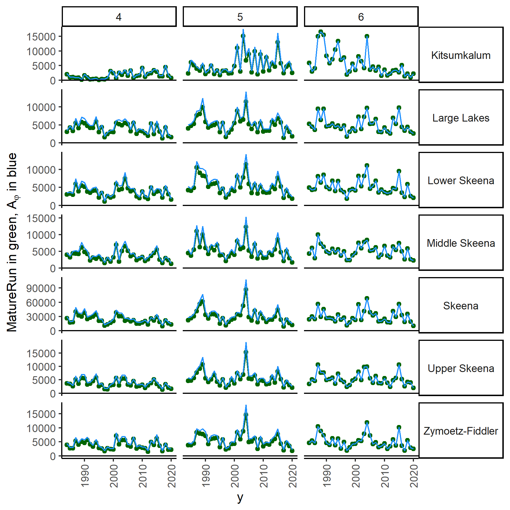
Pre-fishery ocean abundance.

``` r
A_P <- get_A_P( A_phi = A_phi$A_phi, phi_dot_E = ex_phi_dot_E)

ggplot( A_phi$df, aes(y = A_phi, x = y, group = i)) +
  geom_line(colour="dodgerblue") +
  #geom_point(colour ="dodgerblue") +
  geom_line( data = A_P$df, aes(y =A_P, x = y, group = i), colour="darkorange") +
  geom_hline(aes(yintercept=0)) + 
  ylab(TeX("Pre-fishery ocean abundance $A_P$ in orange, $A_\\varphi$ in blue")) +
  facet_grid( i ~ a, scales="free_y") + 
  theme_classic() +
  theme(axis.text.x = element_text(angle=90, vjust=0.5),
        strip.text.y = element_text(angle = 0))
```

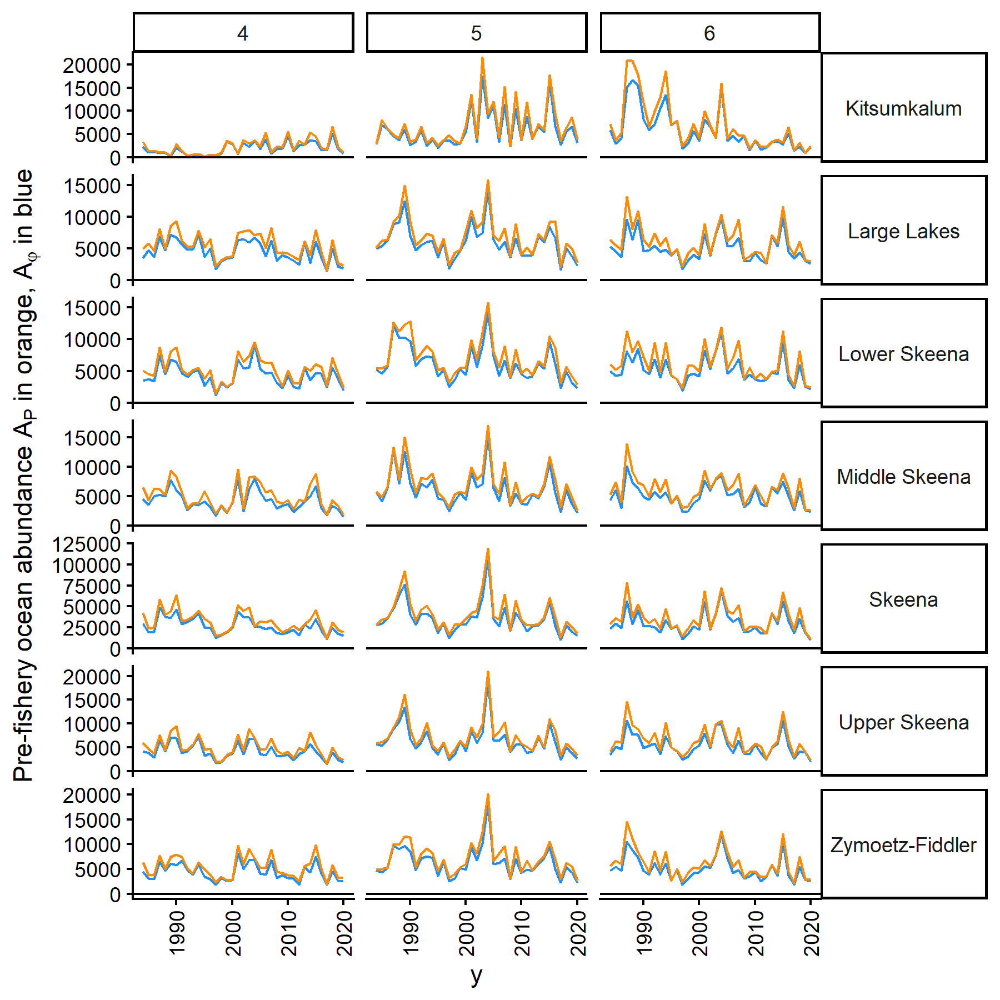

Preterminal fishing mortality in nominal fish.

``` r
phi_N <- get_phi_N( A_P = A_P$A_P, A_phi = A_phi$A_phi)

ggplot( phi_N$df, aes(y = phi_N, x = y, group = i)) +
  geom_line() +
  geom_point() +
  geom_hline(aes(yintercept=0)) + 
  ylab(TeX("Preterminal fishing mortality in nominal fish, $\\varphi_N$")) +
  facet_grid( i ~ a, scales="free_y") + 
  theme_classic() +
  theme(axis.text.x = element_text(angle=90, vjust=0.5),
        strip.text.y = element_text( angle = 0))
```

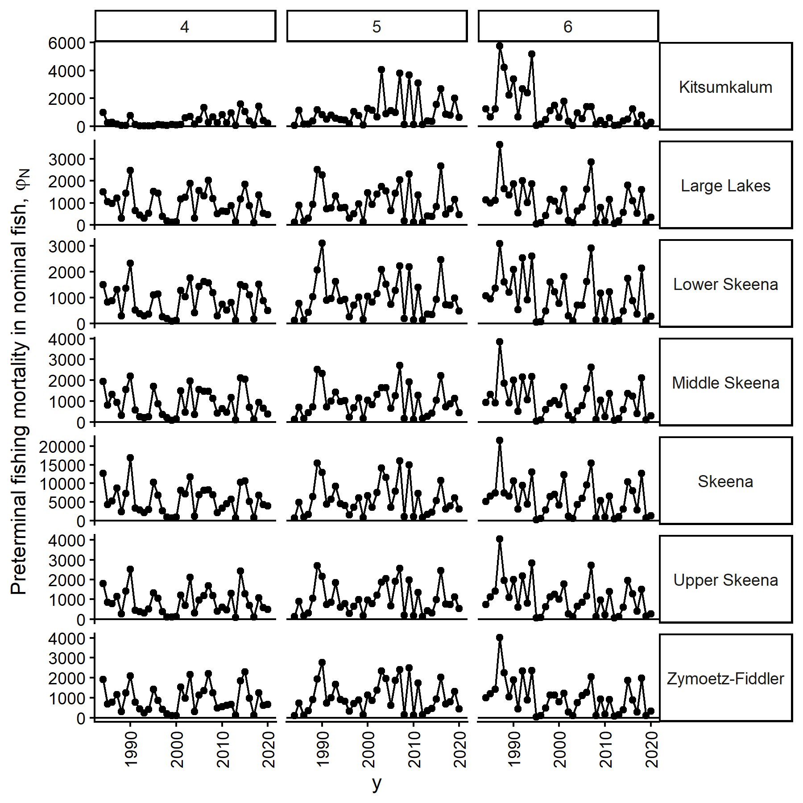

Preterminal fishing mortality in adult equivalents.

``` r
phi_Q <- get_phi_Q( phi_N = phi_N$phi_N, Q = ex_Q)

ggplot( phi_N$df, aes(y = phi_N, x = y, group = i)) +
  geom_line() +
  geom_point() +
  geom_line(data = phi_Q$df, aes( y= phi_Q, x = y), colour="darkorchid1")+
  geom_hline(aes(yintercept=0)) +
  ylab(TeX("Preterminal fishing mortality in adults equivalents $\\varphi_Q$ in purple. $\\varphi_N$ in black")) +
  facet_grid( i ~ a, scales="free_y") +
  theme_classic() +
  theme(axis.text.x = element_text(angle=90, vjust=0.5),
        strip.text.y = element_text(angle = 0))
```

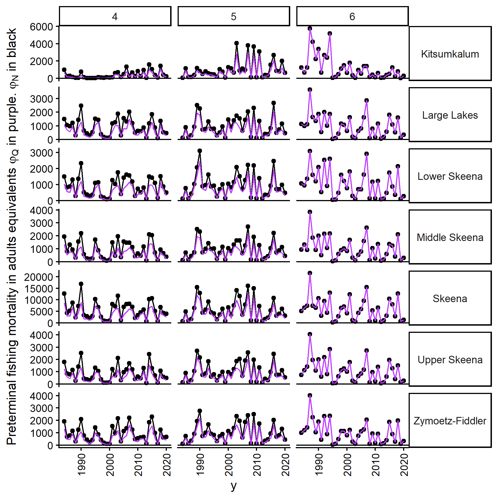

Recruits by return year and brood year.

``` r
R_star <- get_R_star( MatureRun = MatureRun$MatureRun, phi_Q = phi_Q$phi_Q)

ggplot( R_star$df, aes(y = R_star, x = y, group = i)) +
  geom_line() +
  geom_point() +
  geom_line(data = phi_Q$df, aes( y= phi_Q, x = y), colour="darkorchid1")+
  geom_line(data = MatureRun$df, aes(y = MatureRun, x = y), colour = "darkgreen") +
  geom_hline(aes(yintercept=0)) +
  ylab(TeX("$R^*$ in black, $MatureRun$ in green, $\\varphi_Q$ in pink")) +
  facet_grid( i ~ a, scales="free_y") +
  theme_classic() +
  theme(axis.text.x = element_text(angle=90, vjust=0.5),
        strip.text.y = element_text(angle = 0))
```

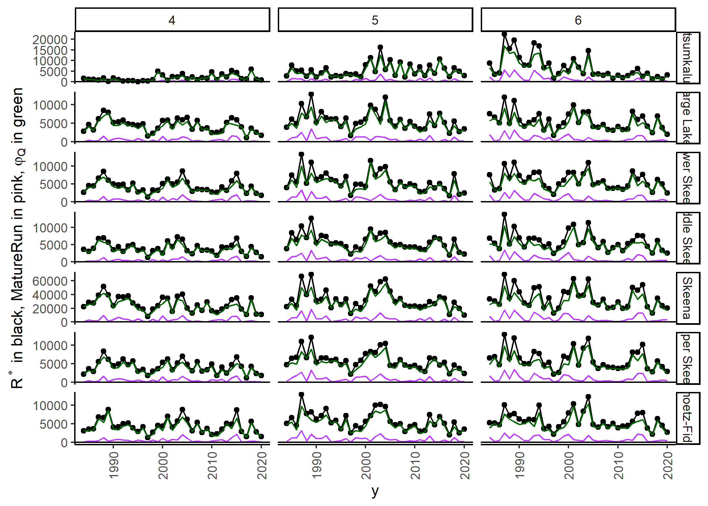

``` r

ggplot( R_star$df, aes(y = R_star, x = b, group = i, colour= complete_brood)) +
  geom_line() +
  geom_point() +
  geom_hline(aes(yintercept=0)) +
  xlab("Brood year") +
  ylab(TeX("$R^*$ by brood year.")) +
  facet_grid( i ~ a, scales="free_y") +
  scale_colour_manual(values = c("gray", "black")) +
  theme_classic() +
  theme(axis.text.x = element_text(angle=90, vjust=0.5),
        strip.text.y = element_text(angle = 0))
```

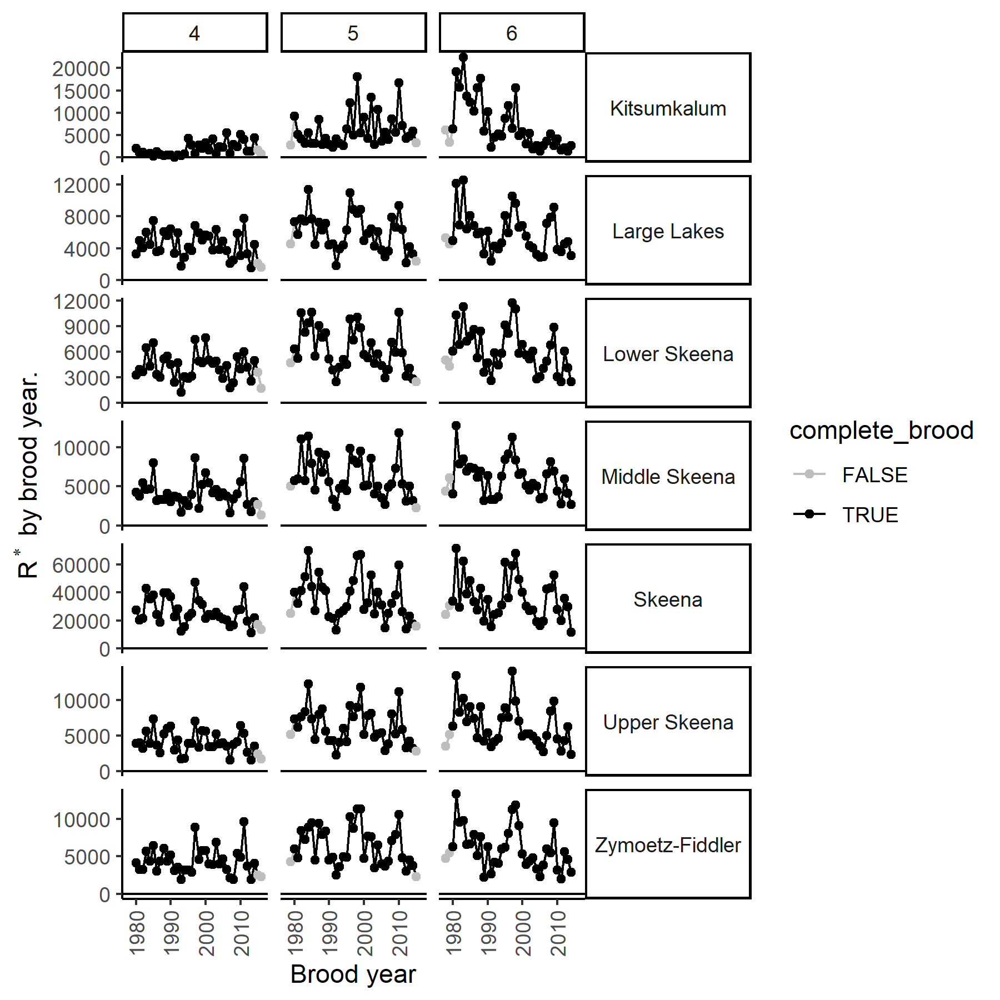

Get recruits by brood year, summed across ages.

``` r
R <- get_R( R_star_b = R_star$R_star_b, R_star_df = R_star$df)

ggplot( R$df, aes(y = R, x = b, group = i, colour = complete_brood)) +
  geom_line() +
  geom_point() +
  geom_hline(aes(yintercept=0)) +
  ylab(TeX("Recruits, $R$")) +
  xlab("Brood year") +
  facet_wrap( ~i , scales="free_y") +
  scale_colour_manual(values = c("gray", "black")) +
  theme_classic() +
  theme(axis.text.x = element_text(angle=90, vjust=0.5))
```

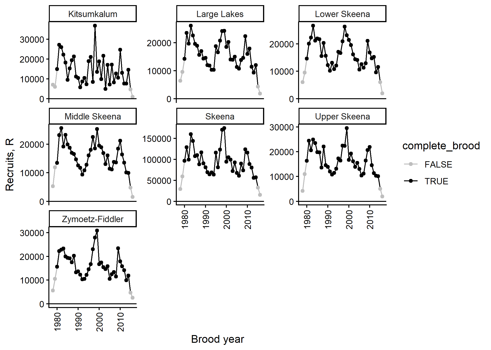
